# Mini Project M2B - TDW (Magic The Gathering Management)

Name: [Vicente Barros](https://gitbub.com/vicentebarros)

Course: [Technologies and Web Development](https://www.ua.pt/en/uc/15381)

Date: 04-12-2024

## Deployment: [https://mei-tdw-m2.vercel.app/](https://mei-tdw-m2.vercel.app/)

## Overview

This project consists in a simple Magic The Gathering (MTG) management system. For this project it was needed to develop a system that consumes data from a REST API and allows the user to interact with it in order apply the knowledge acquired about advanced React concepts. This project followed the same structure as the previous one, using different technologies and concepts from the ones we learnt during classes. Throughout this report we will explain the main features of the project, the technologies used, the architecture of the project, the main challenges faced and the improvements that could be made.

## Selected Theme and API

After searching for different candidates to be used in this project we decided to go with the Magic The Gathering. Magic The Gathering is a trading card game that was created in 1993 by Richard Garfield and published by Wizards of the Coast. The game has a huge fan base and a lot of cards that can be used in different strategies. The first API to be analysed was the [Magic The Gathering API](https://magicthegathering.io/), but it was not possible to get the cards images from it. After that, we found the [Scryfall API](https://scryfall.com/docs/api) which is a free API that in a first glance seemed to have all the data we needed. However, after some simple implementations we found out that the API was not returning images for all cards and lacked some information that we wanted to display. Finally, we found the [MTG API](https://docs.magicthegathering.io/) which is a free API that has a lot more information than the previous ones and also returns images for all cards. This API was the one we used in this project which had some challenges that we will explain later in this report.

### API Endpoints

For the development of this project we used the endpoints related to cards namely:

- **GET /cards/autocomplete**: Endpoint that returns a list of card names that match the query string passed as a parameter which was used to implement the simple search with autocomplete feature which can be seen in the search bar of the application.
- **GET /cards/:id**: Endpoint that returns a card by its **id** which was used to get the card details when the user clicks on a card in the search results.

- **GET /cards/named**: Endpoint that returns a card by its name, using the fuzzy card name, which was used to get the card details when the user clicks on a card in the search results.

- **GET /cards/search**: Endpoint that returns a list of cards that match the query string passed as a parameter which was used to implement the advanced search feature that can be seen in the search page of the application. This endpoint has the particularity of having a custom syntax for the query which need to be parsed in order to get the correct results. For a detailed explanation of the syntax used in the query please refer to the [official documentation](https://scryfall.com/docs/syntax).

- **GET /symbology**: Endpoint that returns the symbols used in the cards which was used to display the proper icons and symbols in the card details page. The api also has a syntax to deliver information about the symbols used in the cards which haded the necessity to parse the response in order to get to display the proper icons and symbols.

#### API Challenges

Despite being a fully functional API, the MTG API had some challenges that we had to overcome in order to get the desired results. The first challenge was the lack of organisation for the endpoints where the filtering are not easy to use and need some hacking. Pagination is possible, though the definition of a custom limit is not possible. The second challenge was the lack of information in the response of the endpoints which made us to make more requests to get the desired information such as card information on different languages. The official site has some interesting features that the public API is not possible by itself.

However, Scryfall provides the full dataset of cards, which could be used to create a custom API that would fit better in our need. Due to lack of implementation time and the complexity of the dataset, we decided to use the MTG API.

## Technologies

Remembering that the idea of using alternative technologies to the ones we used during classes was to learn new concepts and technologies but more importantly try different strategies to render information and serve it to the user.

### Next.js

[Next.js](https://nextjs.org) was used in this project mainly to try different render methods - Server-Side Rendering (SSR), Static Site Generation (SSG) and Client-Side Rendering (CSR) which will explain later in this report. Next being the state of the art way to develop an application due to its flexibility and performance. With a lesser relevance we also used the Next.js Image component which is a component that optimizes the images for the web and also has a lazy loading feature which is very useful when dealing with a lot of images.

### Tailwind CSS and Shadcn/ui

[Tailwind CSS](https://tailwindcss.com) was used in this project to style the components. Tailwind is a utility-first CSS framework that allows the developer to create custom designs without having to write custom CSS. We also used the [Shadcn/ui](https://ui.shadcn.com/) library which is a library that provides a set of components that are already styled with Tailwind CSS.
A particularity of Shadcn/ui is the components instead of being all bundled in a single file, they are separated in different an the developer can choose which component want to install and then customize the code - this components can be found in `components/ui` folder.
This library was used to create the layout of the application and also to create some components that were used in the project.

The main goal of this project was to explore different strategies of rendering and serve the best user experience possible and thus the design was highly simplified.

### Zustand

Instead of using Redux, we decided to use [Zustand](https://zustand-demo.pmnd.rs) which is a small, fast and scalable state management library that allows the developer to create global states that can be shared throughout the application. Zustand proved to be a good alternative to Redux as it is simpler to use and has a better performance overall which a good developer experience avoiding boilerplate code.

### Tanstack Query

Once again, we avoided using the Redux Toolkit Query and decided to use [Tanstack Query](https://tanstack.com) which is a data fetching library that provides a set of hooks that can be used to fetch data from an API. A comparison between Redux Toolkit Query and Tanstack Query and other alternatives can be found in the [official documentation](hhttps://tanstack.com/query/latest/docs/framework/react/comparison#comparison-or-react-query-vs-swr-vs-apollo-vs-rtk-query-vs-react-router).

### Nuqs

[Nuqs](https://nuqs.vercel.app) is a type-sage search params state management library that allows the developer to create a global state that can be shared throughout the application using the URL. The main use-case of this library on this project was to develop pages that is relevant to share the state between different users - a simple example would be the share of a advanced search query from one user to another.

### Typescript

This section is a honorable mention to [Typescript](https://www.typescriptlang.org). Typescript help to keep the types between components and API data consistent and also helps to avoid bugs and errors in the code. Typescript was used in this project to type the components, the API data and the global states - api has a lot of information but only a few is useful for the application.

## Code Organization

Following the good practices of code organization, the project was divided into different folders that represent different parts of the application. The main folders of the project are:

- **app**: Main folder for Next.js application where the pages are located each page has a folder with the same name and the components used in the page are located in the components folder.
- **components**: Folder that contains the components that are used throughout the application
- **hooks**: Folder that contains the hooks that are used throughout the application to fetch data from the API as a matter of example.
- **lib**: Folder that contains the providers, stores, types and utils used to manage the global states of the application and other utilities.

## Main Features

### Simple Search with Autocomplete

The simple search with autocomplete feature allows the user to search for a card by typing the name of the card in the search bar. The search bar has an autocomplete feature that suggests card names that match the query string typed by the user. The user can click or navigate through the suggestions using the arrow keys and select the card by pressing the enter key resulting in the display of the card details.

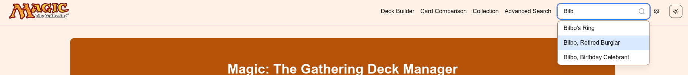

### Deck Builder

The deck builder feature is the simplest implementation in terms of rendering to the end-user. This feature consists in autocomplete search bar similar to the previous example, but instead of redirecting it add the card for the current deck display some statistics about the deck. The main issue with this approach of not using neither Zustand nor Nuqs is the state is lost between renders, provoking the loss of the deck and a bad user experience.

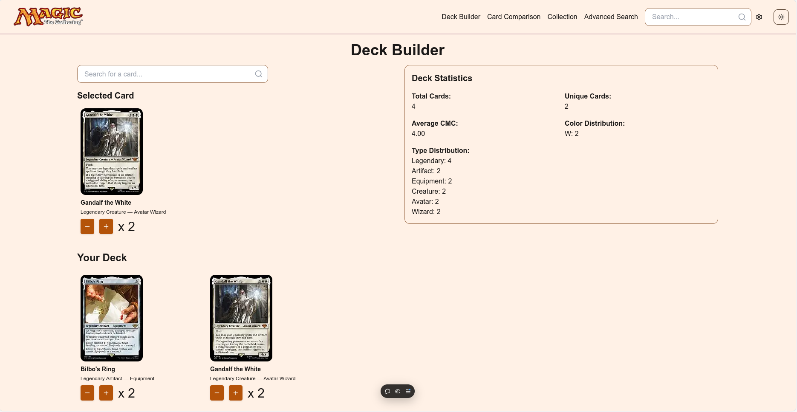

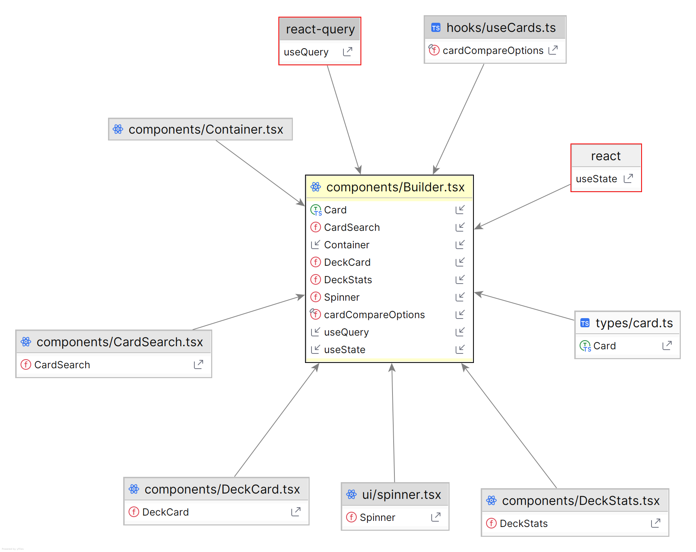

### Card Comparison

The card comparison feature allows the user to compare two cards side by side. The user can select two cards by clicking on the cards in a similar autocomplete search bar and the cards will be displayed side by side in the card comparison page. For this page the state management is done using the URL and the Nuqs library. This approach allows the user to share the comparison between different users. However, the state is lost when the user navigates to another page.

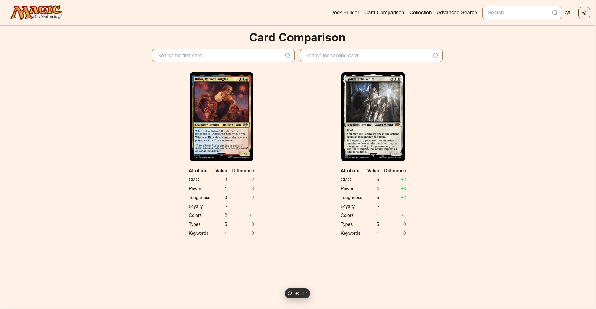

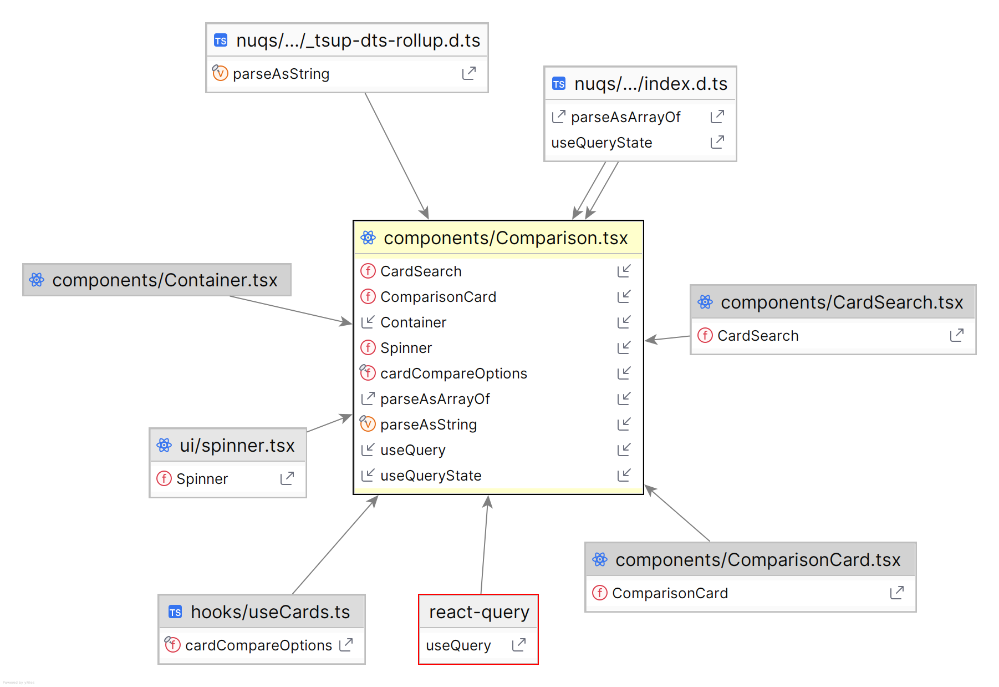

### Collection

Collection is, as the name suggest, a way to track the favorite, owned or wanted cards. A card can be added to the collection by clicking on the card with the right mouse button and selecting the option to add to the collection. The collection component displays the cards that are in the collection and allows the user to remove the cards from the collection. Since the collection need to be accessible throughout the application, the state is managed using the Zustand library which store not only global states but also the states that are persisted in the local storage. This way the user can manage all their collection in different pages.

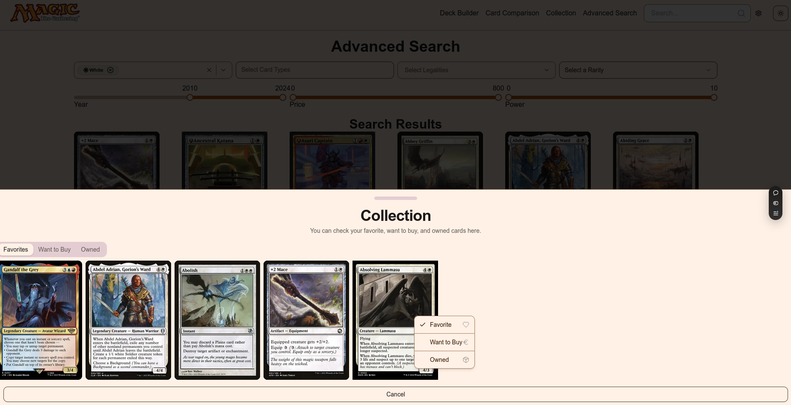

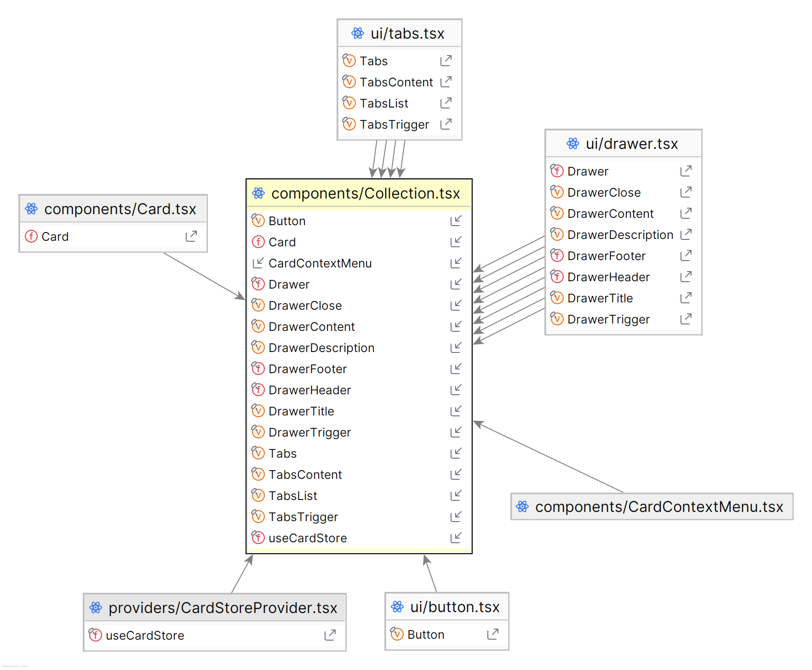

### Advanced Search

The advanced search is to more complete and complex part of the application. As previously stated the API has a custom syntax that needs to be parsed in order to get the correct results. The user workflow is to combine different filters and when the desired result is achieved the page will render the result with an infinite scroll to enhance the user experience. Since sharing the result of the search is relevant, the state is managed using the URL and the Nuqs library. This way the user can share the search result with other users.

This page has a particular feature which is the Server-Side-Rendering (SSR) with Hydration on the client-side which means, the first API fetch is made on the server side and rendered fully on the client side and then when the user scrolls the page the new cards are fetched on the client side. This approach was used to enhance the user experience and avoid the user to wait for the full page to be rendered and helping on the SEO.

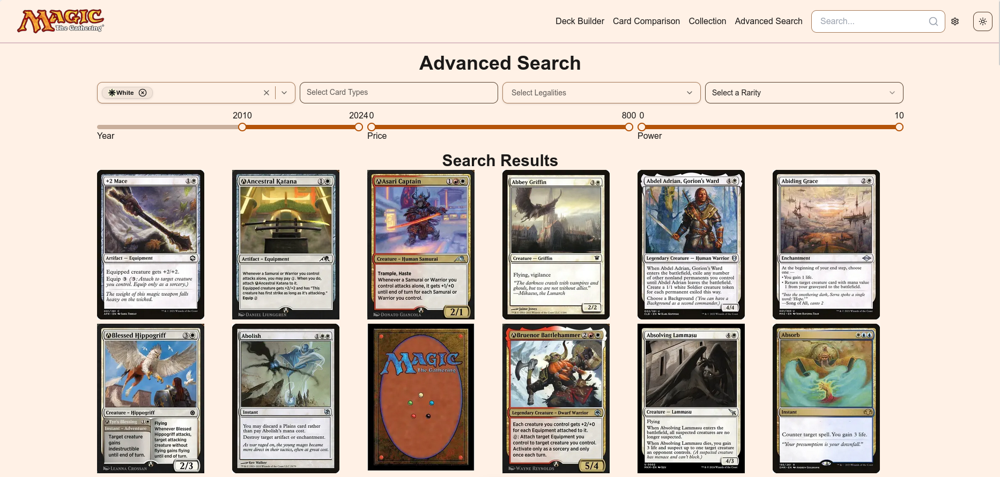

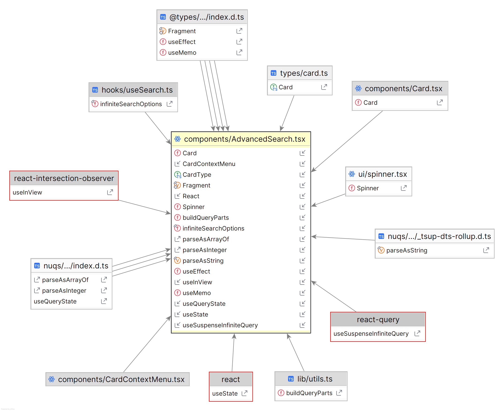

### Card Details

Cards details is the page that displays the details of a card. The user can access this page by clicking on a card in the search results or by clicking on a card in the collection. The card details page displays some information about the card where some of them are clickable and will redirect the user to the advanced search page with the filter already applied helping the site navigation. In this page is possible to see the parser of the text being done on the Mana Cost and the Card Text.
This page is Server-Side-Rendering (SSR) without Hydration on the client-side since the card details will not change after the first render. The only exception is the currency conversion that is done on the client side depending on the user preference. It was also thought to do language conversion but the API does not provide the information in the response.

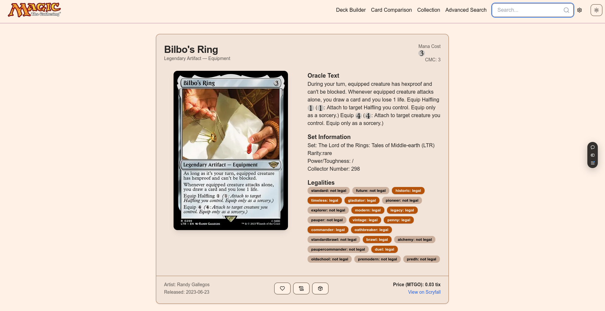

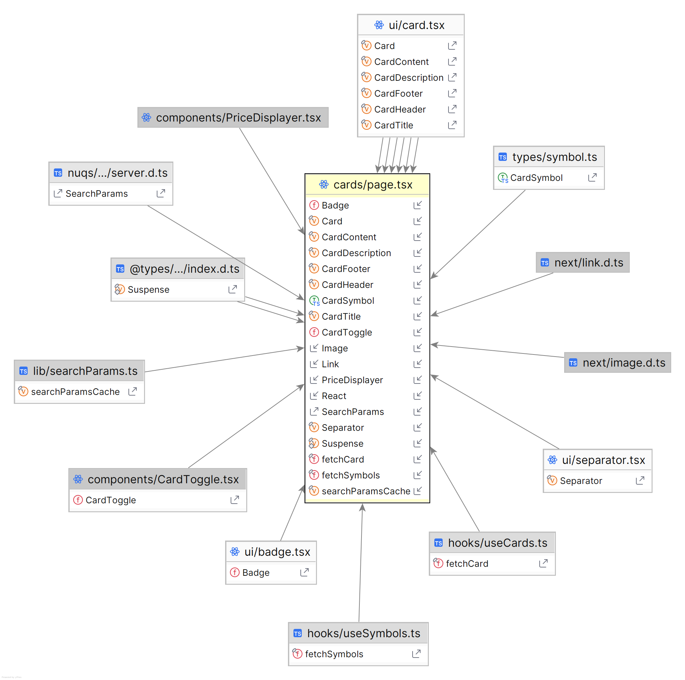

### Landing Page

The landing page is the first page that the user sees when accessing the application. The landing page has a simple design which used Static Site Generation (SSG) to render the page due to the lack of dynamic content.

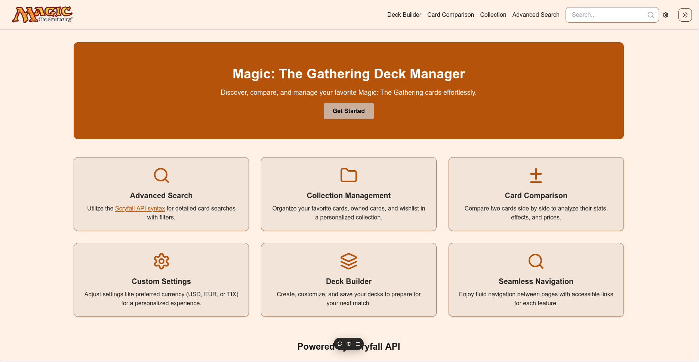

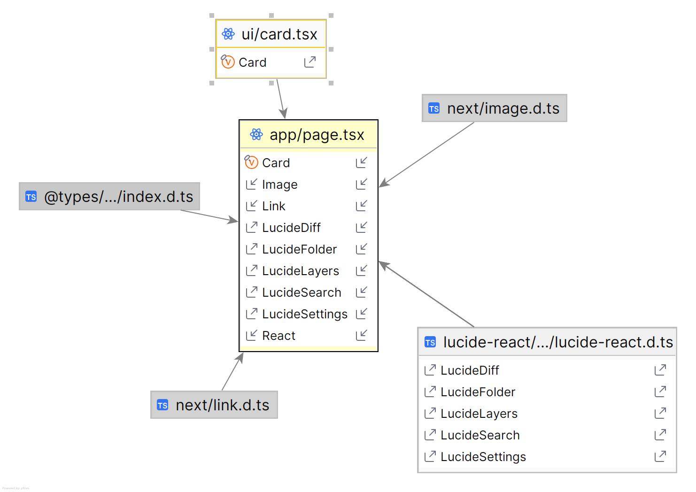

## CI/CD

The development of this project was simplified due to the limited time. The first attempt of deployment was using GitHub Pages which was later discard in favor of Vercel. The deployment was done using the Vercel platform with a production deployment of the main git branch and a preview deployment of the dev branch. When commiting to dev a GitHub action is run to analyse the code on formating using Prettier, linting using ESLint and type-checking using Typescript. The code is only merged to the main branch if the action is successful.

### Conclusions and Future Work

This project was a great opportunity to learn new concepts and technologies and to try different strategies to render information and serve it to the user. The project was a success in terms of the main features implemented and the technologies used. However, the development of a custom API and the integration of an Auth system would provide a better UX for the user.
